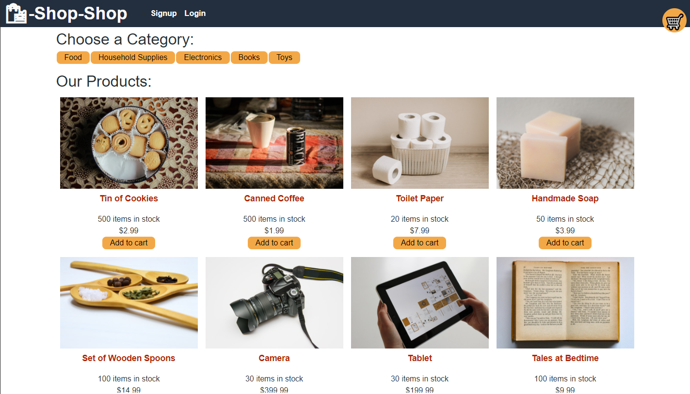

# Store-Redux
A store front that uses Redux to manage global state

## Table of Contents

1. [Description](#description)

1. [Technologies and Skills](#technologies)

1. [Screenshot](#screenshot)

1. [Link to Deployed App](#sample)

1. [Installation](#installation)

1. [Use](#usage)

1. [License](#license)

1. [Author](#author)

1. [Contact](#contact)

## Description

* A shopping app that allows sign up/log in, a shopping cart to hold store items using React and react-Redux to manage global state

## Technologies and Skills Demonstrated

* Mongodb
* Express
* React
* Node
* Bootstrap

## Screenshots

## Visit the App deployed on Heroku

* [Link to Deployed Application](https://hidden-depths-95251.herokuapp.com/)

## Installation

* Run the following to install dependancies

> npm install

## Usage

* The repo can be forked and then the required modules installed as per above.  The application is run from the command line by entering "npm run develop"

## License

- MIT

## Author

* Ben Slinde

## Contact me

* If you would like, you can connect with me thru my github profile [Github Profile](https://github.com/stevenslade)